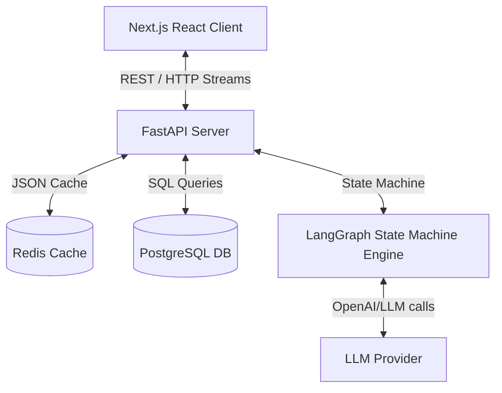

# JD-Agent Codebase Architecture

This directory serves as the persistent "Agent Brain" for the JD-Agent project. This document provides a high-level architectural overview of the system, including component layouts, flow diagrams, and key interface boundaries.

---

## Directory Map

### Root Workspace: `/Users/manideekshith/Desktop/JD-Agent`
* **`/backend`**: Python FastAPI app with SQLAlchemy ORM, Alembic migrations, Redis caching, and LangGraph conversational agents.
* **`/frontend`**: Next.js (App Router or Pages Router) application featuring Lucide React icons, TanStack React Query, Zustand state stores, and Tailwind CSS.
* **`/scripts`**: Shell scripts for optimization and startup.
* **`/.agent_memory`**: This folder. Contains structured agent brain files mapping out the system state to avoid expensive file traversals.

---

## Core System Architecture

### 1. Frontend Client
* **Entry Point Hook**: [useChat.ts](file:///Users/manideekshith/Desktop/JD-Agent/frontend/hooks/useChat.ts) manages SSE connection streams, parses responses, and dispatches page-level state updates.
* **Selection Gating**: Controls dynamic panels like priority task selectors, tools, and skills confirmed cards via helper methods like `shouldShowPrioritySelection()`.

### 2. Backend FastAPI Router
* **Endpoint File**: [jd_routes.py](file:///Users/manideekshith/Desktop/JD-Agent/backend/app/routers/jd_routes.py) manages route entries, sessions, database transactions, and cache orchestration.
* **Stream Endpoint**: `/stream` initiates the LangGraph execution generator.
* **Confirmation Endpoints**: `/confirm-skills`, `/confirm-tools`, and `/confirm-priority-tasks` are dedicated POST handlers allowing the user to lock in selection criteria mid-session.

### 3. LangGraph Conversational Agent Engine
* **Graph Definition**: [graph.py](file:///Users/manideekshith/Desktop/JD-Agent/backend/app/agents/graph.py) builds the LangGraph topology, routing between nodes and sanitizing output via `_build_frontend_response`.
* **State Struct**: [state.py](file:///Users/manideekshith/Desktop/JD-Agent/backend/app/agents/state.py) holds internal state dictionaries.
* **Agent Nodes**: [interview.py](file:///Users/manideekshith/Desktop/JD-Agent/backend/app/agents/interview.py) encapsulates prompting logic for phase-specific agents (e.g. `BasicInfoAgent`, `WorkflowIdentifierAgent`, `ToolsAgent`, `SkillsAgent`).
* **Router Logic**: [router.py](file:///Users/manideekshith/Desktop/JD-Agent/backend/app/agents/router.py) computes active agent transitions (`compute_current_agent`) and calculates state progression metrics (`compute_progress`).

---

## Token and Optimization Policy

To conserve LLM tokens and optimize performance, follow these guidelines:
1. **Caching**: Utilize the Redis cache (`session:{session_id}`) to store pre-deserialized `SessionMemory` state objects.
2. **Conversation Turn Windows**: While the full chat history is fetched and synced inside the DB, cap the LLM prompt context window using the `llm_limit` sliding window parameter (defaulting to 6 turns).
3. **Agent Memory Traversal Avoidance**: Do not inspect raw code files repeatedly; rely on the metadata in `/.agent_memory` for architectural context.
