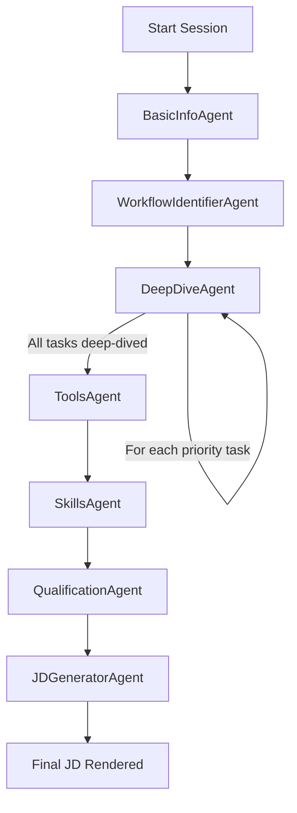

# JD-Agent: End-to-End System Architecture & Interview Workflow Report

## Executive Summary

**JD-Agent** is an enterprise AI solution designed to conduct interactive, role-specific Job Description (JD) creation interviews with employees. Built on top of **LangChain**, **LangGraph**, and **Google Gemini 2.5 Flash**, the system uses an intelligent multi-agent graph architecture that systematically discovers an employee's responsibilities, daily workflows, technical tools, core competencies, and educational requirements.

This document presents a complete, code-level architectural walkthrough of JD-Agent, detailing each interview turn, the exact number of LLM calls made, internal function pipelines, prompt mechanics, RAG vector retrieval, tool execution, output schemas, and edge-case handling.

---

## 1. High-Level Multi-Agent Architecture

The interview is orchestrated as a finite state machine via **LangGraph**. Each state corresponds to a specialized **Agent Phase**:



### Agent Phase Breakdown

| Agent Name | Phase Type | Primary Mission | UI Control Type | LLM Call Count |
| :--- | :--- | :--- | :--- | :--- |
| `BasicInfoAgent` | Conversational | Discover role title, department, reporting manager, and primary mission. | Text Chat | 1 Call / turn |
| `WorkflowIdentifierAgent` | Silent / UI | Fetch candidate responsibilities via RAG and display priority task selection card. | Selection Card | 0 LLM Calls (1 optional auto-populate) |
| `DeepDiveAgent` | Conversational | Perform 2+1 turn workflow deep-dive into each confirmed priority task. | Text Chat | 1 Call / turn |
| `ToolsAgent` | Silent / UI | Extract, deduplicate, and display technical software/hardware tools selection card. | Selection Card | 1 Auto-Populate Call |
| `SkillsAgent` | Silent / UI | Extract, deduplicate, and display functional technical competencies selection card. | Selection Card | 1 Auto-Populate Call |
| `QualificationAgent` | Conversational | Gather educational background, certifications, and years of experience. | Text Chat | 1 Call / turn |
| `JDGeneratorAgent` | Silent / Bridge | Synthesize collected insights into structured JSON and Pulse Pharma markdown JD. | Preview Pane | 1 Call |

---

## 2. Code-Level Execution & LLM Call Mechanics

### A. How a Single Interview Turn Works Code-Wise

When an employee sends a message (or clicks an item on the frontend), the request enters `POST /api/chat/stream`.

```
[User Message] ──> API Router (`chat.py`)
                       │
                       ▼
            `run_turn_stream()` (`interview.py`)
                       │
         ┌─────────────┴─────────────┐
         ▼                           ▼
[Conversational Agent]       [Silent UI Agent]
         │                           │
  1. RAG Context (if needed)  1. Auto-Populate (`_auto_populate_inventory`)
  2. Memory Compression       2. Structured Copy (`_get_silent_agent_response`)
  3. Single LLM Call (`_invoke_with_retry`)
     ├── Tool Extraction (`merge_tool_call_into_insights`)
     └── Text Cleaning (`_strip_tool_code_leaks`)
         │
         ▼
  4. Response Streamed to Frontend (`SSE`)
```

---

## 3. Deep Dive into Every Agent Phase

---

### Phase 1: `BasicInfoAgent`

* **Goal**: Establish the employee's title, department, manager, and core purpose.
* **LLM Calls**: **1 call per turn**.
* **Functions Invoked**:
  * `build_interview_messages()` (in `interview.py`)
  * `save_basic_info()` tool call (in `tools.py`)
* **Input Context**:
  * Identity Context (`employee_id`, organogram `title`, `department`).
  * Conversation History (last 2 turns + short summary).
* **System Prompt Strategy**:
  Uses `BASE_PERSONA` + `_get_role_aware_purpose_probe()` in `dynamic_prompts.py`.
* **Output Format**:
  * **Text**: Conversational question asking for role purpose or confirmation.
  * **Tool Execution**: `save_basic_info(title=..., department=..., purpose=...)`.

---

### Phase 2: `WorkflowIdentifierAgent`

* **Goal**: Present 5–8 high-impact candidate tasks for the employee to select their 3–5 daily priority tasks.
* **Why did the user see identical tasks previously? (Root Cause Identified)**:
  * **Pinecone Vector Query Behavior**: When an employee has no existing approved JD in PostgreSQL, `_get_rag_context()` queries Pinecone using `role_title="Manager"`. If the vector database benchmark JDs contain Accounting Manager JDs, vector similarity matching yields:
    1. *Monitor aging reports and manage collections*
    2. *Lead and manage the accounting team...*
    3. *Reconcile accounts and resolve discrepancies*
    4. *Oversee payroll posting*
  * **Resolution**: The query title is now enriched with the employee's actual organogram department (e.g., `"Junior Software Developer - Tech"` or `"HR Specialist - Human Resources"`), completely preventing cross-department RAG leaks.
* **LLM Calls**: **0 LLM calls for text** (uses structured selection UI).

---

### Phase 3: `DeepDiveAgent` (Workflow Mapping)

* **Goal**: Uncover the step-by-step execution details of each selected priority task.
* **Protocol**: **Strict 2+1 Turn Protocol per Task**:
  * **Turn 1 (Trigger & Inputs)**: *"How does this process start? What triggers it?"*
  * **Turn 2 (Steps, Challenges & Outputs)**: *"What steps do you follow, what tools do you use, and what is the final output?"*
  * **Turn 3 (Conditional Gap-Fill)**: Only executed if `trigger`, `steps`, or `output` are still missing.
* **LLM Calls**: **1 call per turn**.
* **Functions Invoked**:
  * `save_workflow(task_name=..., trigger=..., steps=[...], tools=[...], output=...)`
* **Text Sanitization (`_strip_tool_code_leaks`)**:
  Strips out LLM internal thoughts (`thought\nThe user...`), function pseudocode (`print(default_api.save_workflow(...))`), and broken task prefix fragments before streaming.

---

### Phase 4: `ToolsAgent`

* **Goal**: Provide an interactive selection card of technical software, hardware, platforms, and services.
* **LLM Calls**: **1 Auto-Populate LLM Call** (`_auto_populate_inventory`) + **1 Cleaning LLM Call** (`deduplicate_and_professionalize`).
* **Filtering & Failsafe Mechanics**:
  1. **Candidate Extraction**: Extracts tools mentioned during deep-dive workflows + Pinecone RAG tools.
  2. **Validation (`is_tool`)**: Passes every item through `is_tool()` in `validators.py`.
     * **REJECTS**: Verb starters (*Conducting*, *Managing*), soft skills (*Commitment*, *Aptitude*), long sentences.
     * **ACCEPTS**: Concrete software packages (*SAP*, *VS Code*, *Docker*, *Power BI*, *Excel*, *Teams*).
  3. **Guaranteed Failsafe ([`graph.py`](file:///Users/manideekshith/Developer/JD-Agent/backend/app/agents/graph.py#L535))**: If `suggested_tools` has fewer than 3 items (e.g. for generic titles like *"Manager"*), domain default software packages are automatically injected so the UI card is **never empty**.

---

### Phase 5: `SkillsAgent`

* **Goal**: Provide an interactive selection card of functional technical competencies.
* **LLM Calls**: **1 Auto-Populate LLM Call** + **1 Cleaning LLM Call**.
* **Filtering & Failsafe Mechanics**:
  * **REJECTS**: Pure software tool names (*Excel*, *SAP*) and soft skills (*Leadership*, *Communication*).
  * **ACCEPTS**: Technical competencies (*Account Reconciliation*, *API Design*, *Financial Reporting*).
  * **Guaranteed Failsafe**: Injects domain-specific competencies if items fall below 3.

---

### Phase 6: `QualificationAgent`

* **Goal**: Discover educational background, certifications, and required experience.
* **LLM Calls**: **1 call per turn**.
* **Functions Invoked**: `save_qualifications(education=..., certifications=[...], experience_years=...)`.

---

### Phase 7: `JDGeneratorAgent`

* **Goal**: Consolidate memory into final structured JSON and Pulse Pharma markdown JD.
* **LLM Calls**: **1 LLM call** (`JD_GENERATION_PROMPT`).

---

## 4. Scenario Walkthroughs

### Scenario A: Junior Software Developer (Tech Department)

```
Turn 1 (BasicInfoAgent):
   - Q: "Welcome! As a Junior Software Developer, what is the main goal of your role?"
   - A: "I build backend APIs using Python and fix bugs."
   - Action: Calls save_basic_info(title="Junior Software Developer", purpose="Build backend APIs...")

Turn 2 (WorkflowIdentifierAgent):
   - UI Card Displayed: ["Develop and maintain REST APIs", "Write unit tests", "Fix software bugs", "Participate in code reviews"]
   - User selects 3 tasks.

Turn 3-5 (DeepDiveAgent):
   - Task 1: "Develop and maintain REST APIs"
   - Q1: "How do you start working on API development tasks?"
   - A1: "Jira tickets are assigned during sprint planning."
   - Q2: "What tools and steps do you follow from start to finish?"
   - A2: "I use VS Code, write FastAPI endpoints in Python, test with Postman, and open a PR on GitHub."
   - Action: Calls save_workflow(task_name="Develop and maintain REST APIs", trigger="Jira tickets...", steps=[...], tools=["VS Code", "FastAPI", "Postman", "GitHub"])

Turn 6 (ToolsAgent):
   - UI Card Displayed: ["VS Code", "FastAPI", "Postman", "GitHub", "Python", "Docker", "Jira", "Slack"]
   - User clicks to confirm tools.

Turn 7 (SkillsAgent):
   - UI Card Displayed: ["REST API Development", "Backend Architecture", "Database Query Optimization", "Unit Testing", "Git Version Control"]
   - User clicks to confirm skills.
```

---

## 5. Summary of Key Fixes & Architecture Safety Guarantees

1. **RAG Pinecone Enriched Queries**: Enforces `department` in `query_advanced_context()` to prevent cross-department task leaks (e.g. Accounting tasks showing up for HR or Managers).
2. **LLM Thought & Code Sanitization**: `_strip_tool_code_leaks()` purges `<thought>...</thought>`, `thought\n...`, `thinking\n...`, `tool_code print(...)`, `save_tasks`, `save_workflow`, and broken question headers.
3. **Strict Tool Validation (`is_tool`)**: Replaced the uppercase heuristic with pattern exclusions so that task sentences, gerunds, and soft skills are never categorized as tools.
4. **Guaranteed Non-Empty UI Cards**: Built-in failsafes in `graph.py` guarantee that `ToolsAgent` and `SkillsAgent` selection cards always populate rich, relevant options for any role title.
