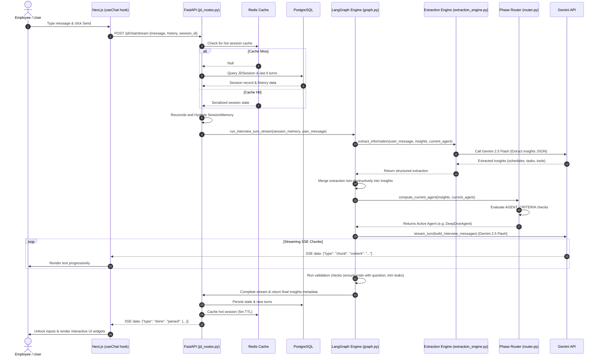
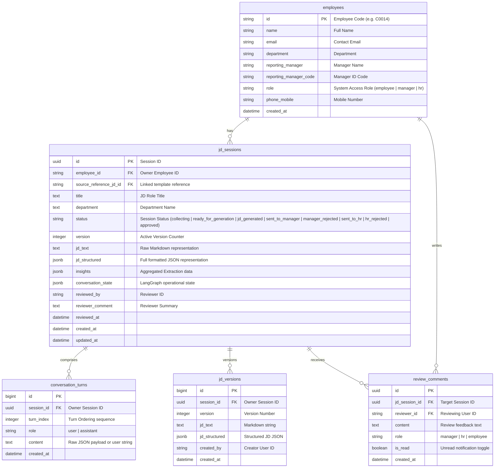

# JD-Agent Technical Architecture & Workflow Design

Welcome! This document provides an in-depth, interactive architectural guide and complete end-to-end workflow walkthrough of the **JD-Agent** system. It details the exact relationships, triggers, data flows, and database schemas of the entire application.

---

## 🗺️ High-Level System Architecture

This diagram illustrates the multi-tier topology of **JD-Agent**, depicting how the React/Next.js frontend connects to the FastAPI backend, which orchestrates relational, cache, vector, and LLM services.

```mermaid
graph TD
    %% Styling
    classDef frontend fill:#3b82f6,stroke:#1d4ed8,stroke-width:2px,color:#fff;
    classDef backend fill:#10b981,stroke:#047857,stroke-width:2px,color:#fff;
    classDef storage fill:#f59e0b,stroke:#b45309,stroke-width:2px,color:#fff;
    classDef ai fill:#8b5cf6,stroke:#6d28d9,stroke-width:2px,color:#fff;

    %% Frontend Components
    subgraph Frontend [Next.js Web App]
        UI["Interactive UI Components (React)"]:::frontend
        UC["useChat Hooks & State Management"]:::frontend
    end

    %% Backend Layers
    subgraph Backend [FastAPI Server]
        R["FastAPI Routers (REST Endpoints)"]:::backend
        S["JD Service Layer (Orchestrator)"]:::backend
        LM["LangGraph Multi-Agent Engine"]:::backend
        EX["Extraction & Semantic Engines"]:::backend
        VS["Pinecone Vector Service"]:::backend
    end

    %% Storage Services
    subgraph Storage [Persistent & Cache Storage]
        DB[("PostgreSQL Database (SQLAlchemy)")]:::storage
        Cache[("Redis Session Cache")]:::storage
    end

    %% AI Services
    subgraph AI [Google Gemini Integration]
        Embed["gemini-embedding-001 (Embeddings)"]:::ai
        Flash["gemini-2.5-flash (Conversational Interview)"]:::ai
        Pro["gemini-2.5-pro (Synthesis & JD Generation)"]:::ai
    end

    %% Vector Database
    subgraph Vector [Semantic Retrieval]
        PC[("Pinecone Serverless Index")]:::storage
    end

    %% Connections
    UI <--> |REST & Server-Sent Events (SSE)| R
    UC <--> UI
    R <--> |Get/Set Active Session| Cache
    R <--> |Hydrate / Persist State| DB
    R <--> S
    S <--> LM
    LM <--> |State Graph turns| EX
    LM <--> |Surgical category retrieval| VS
    VS <--> Embed
    VS <--> PC
    EX <--> Flash
    S <--> Pro
```

---

## 🌀 Message Processing & Multi-Agent State Loop

Every turn of a conversational interview (streamed back to the user via Server-Sent Events) follows a highly resilient, two-pass pipeline designed to extract data first and then formulate next-step questions.



---

## 🧩 Architectural Phases & Routing Criteria

The system ensures a strict, linear flow from start to finish. Below are the sequential phases, along with their gating mechanisms managed by the `Router` (`backend/app/agents/router.py`).

| Phase # | Active Agent | Progress Range | Completion/Gating Criteria | Triggered Actions |
| :--- | :--- | :---: | :--- | :--- |
| **1** | **BasicInfoAgent** | `0% ➔ 15%` | Purpose captured (>= 10 chars) AND (cadence probed over >= 3 turns OR >= 4 tasks identified) or 5 turns hard stop. | Probes roles, reporting lines, and overall purpose of the employee. |
| **2** | **WorkflowIdentifierAgent** | `15% ➔ 25%` | At least 1 priority task selected, or 4 turns guardrail limit. | Renders interactive checkbox UI in the frontend where the employee selects their top 3-5 high-impact tasks. |
| **3** | **DeepDiveAgent** | `25% ➔ 85%` | All chosen priority tasks have been fully visited and analyzed. | Executes a **strict 2+1 turn protocol** for each selected task (Compulsory Turn 1: Triggers/Inputs; Compulsory Turn 2: Challenges/Outputs; Optional Turn 3: Edge cases). |
| **4** | **ToolsAgent** | `85% ➔ 90%` | Tools confirmed via interactive UI, or 3 turns guardrail limit. | Uses surgical RAG retrieval from Pinecone to present standard tools. Renders selectable inventory chips. |
| **5** | **SkillsAgent** | `90% ➔ 95%` | Skills confirmed via interactive UI, or 3 turns guardrail limit. | Uses surgical RAG retrieval from Pinecone to present standard competencies. Renders selectable inventory chips. |
| **6** | **QualificationAgent** | `95% ➔ 99%` | At least 2 turns (capturing education & experience details) or 3 turns guardrail limit. | Probes academic credentials, certifications, and industry background. |
| **7** | **JDGeneratorAgent** | `100%` | Triggers when all prior phases are complete. | Synthesizes the final Job Description. |

---

## 🗄️ Database Schema & Relationships

The PostgreSQL relational structure (`backend/app/models/`) is fully tuned for performance with composite indexes designed for the sidebar queries, manager queues, and HR dashboards.



---

## ⚡ File-by-File Operational Directory

Here is a directory of which file contains what code and what operations they trigger:

### 1. Frontend Layer (`frontend/`)

* **[page.tsx](file:///Users/manideekshith/Desktop/JD-Agent/frontend/app/page.tsx)**: The landing panel. Triggers employee SSO login and searches employees from directory.
* **[sso-sync / login_organogram](file:///Users/manideekshith/Desktop/JD-Agent/frontend/app/sso/page.tsx)**: SSO redirection screen. Calls `/auth/sso-sync` on the backend to synchronize profiles.
* **[questionnaire/[id]/page.tsx](file:///Users/manideekshith/Desktop/JD-Agent/frontend/app/(dashboard)/questionnaire/[id]/page.tsx)**: The interview workspace. Integrates the chat log, interactive selection widgets, fallback voice transcription synthesis, and sliding JD preview panel.
* **[useChat.ts](file:///Users/manideekshith/Desktop/JD-Agent/frontend/hooks/useChat.ts)**: Next.js state machine. Handles incoming stream payloads, handles SSE chunks, holds state for tools/skills inventory choices, and triggers explicit calls like `/jd/generate`, `/jd/save`, and `/jd/confirm-skills`.

### 2. Backend Router Layer (`backend/app/routers/`)

* **[main.py](file:///Users/manideekshith/Desktop/JD-Agent/backend/app/main.py)**: The API Gateway. Loads Gzip and CORS middleware, registers lifespan callbacks to trigger database migrations, and exposes readiness checks mapping DB, Redis, and Pinecone status.
* **[organogram_routes.py](file:///Users/manideekshith/Desktop/JD-Agent/backend/app/routers/organogram_routes.py)**: Synchronizes profiles. Resolves hierarchy roles (employee, manager, head, hr) based on the organogram table, syncs entries to PostgreSQL, and builds recursive territory hierarchy trees.
* **[jd_routes.py](file:///Users/manideekshith/Desktop/JD-Agent/backend/app/routers/jd_routes.py)**: Orchestrates active session endpoints. Exposes endpoints to initialize interviews, handle sync and stream chat turns, trigger JD drafts, capture tool confirmations, save final versions, retrieve comments, and download branded documents.

### 3. Service Layer (`backend/app/services/`)

* **[jd_service.py](file:///Users/manideekshith/Desktop/JD-Agent/backend/app/services/jd_service.py)**: The integration controller. Runs LLM retries on transient errors, extracts valid JSON from complex LLM outputs using Stack bracket counters, merges new extractions into insights, and manages the JD synthesis prompt.
* **[vector_service.py](file:///Users/manideekshith/Desktop/JD-Agent/backend/app/services/vector_service.py)**: Coordinates vector search. Generates embeddings, segments and indexes approved JDs into Pinecone with categorical headers (`role_summary`, `responsibilities`, `tools`, `skills`, `qualification`, `workflow`), and conducts advanced RAG searches.
* **[docx_generator.py](file:///Users/manideekshith/Desktop/JD-Agent/backend/app/services/docx_generator.py)**: Document generation engine. Takes structured JSON schemas and generates branded, formatted MS Word documents (.docx) ready for corporate distribution.

### 4. LangGraph Multi-Agent Engine (`backend/app/agents/`)

* **[graph.py](file:///Users/manideekshith/Desktop/JD-Agent/backend/app/agents/graph.py)**: LangGraph builder. Declares the state graph nodes and sets up the linear edges flowing from the Router node through specific agent nodes into the Gap Detector and out to the end.
* **[router.py](file:///Users/manideekshith/Desktop/JD-Agent/backend/app/agents/router.py)**: Orchestration logic. Holds strict `AGENT_ORDER` arrays, checks the status of collected insights against completion criteria, and calculates the overall completion percentage.
* **[extraction_engine.py](file:///Users/manideekshith/Desktop/JD-Agent/backend/app/agents/extraction_engine.py)**: Deep intelligence extractor. Inspects the user's message using targeted prompts to extract job parameters before the conversational node responds.
* **[interview.py](file:///Users/manideekshith/Desktop/JD-Agent/backend/app/agents/interview.py)**: Conversational builder. Formulates questions using dynamic prompts, retrieves context from Pinecone, checks for repeated questions, and enforces strict punctuation and length validations.
* **[gap_detector.py](file:///Users/manideekshith/Desktop/JD-Agent/backend/app/agents/gap_detector.py)**: Compliance manager. Reviews collected insights for quality gaps (missing outputs, frequencies, context anomalies) and reports an overall compliance rating.

---

## 🚀 Step-by-Step System Lifecycle Walkthrough

Here is the exact operational flow when an employee runs an interview:

### Phase A: Synced Identity Login
1. The user logs in with their Employee Code on the **Next.js Frontend**.
2. **FastAPI Backend** processes the login request through `auth/sso-sync` inside `organogram_routes.py`. It looks up hierarchy relations in the `organogram` table, derives their system role, upserts their profile into the `employees` table, and returns their profile.
3. The frontend stores their identifier and department in a local secure cookie.

### Phase B: Session Start & Context Pre-fill
1. The user clicks "Start New Interview", triggering `POST /jd/init` inside `jd_routes.py`.
2. The router pulls employee information (e.g. reporting structure, designation, date of joining) from the database and inserts it as **pre-filled identity context** in the session memory.
3. A UUID is generated for the session, saved in `jd_sessions`, and returned to the frontend.

### Phase C: Conversational Interview Turn
1. The user writes a message and clicks send. The Next.js frontend calls `POST /jd/chat/stream` using the SSE-enabled `useChat` hook.
2. The backend hydrates session data from **Redis** (or PostgreSQL) into a transient `SessionMemory` instance.
3. The server invokes `handle_conversation_stream` in `jd_service.py`, which delegates to the LangGraph runner.
4. **First Pass (Extraction)**: `extraction_engine.py` calls Gemini 2.5 Flash to extract raw structured insights (e.g., specific tasks, operational cadence) from the user's message.
5. **Insights Merging**: These insights are merged into session memory, and the current active agent is evaluated against the gating criteria in `router.py`.
6. **Second Pass (Conversation)**: The active agent builds a dynamic prompt, pulls RAG context from Pinecone, and streams the conversational response.
7. **Validation & Cache**: The response is validated (ensuring it ends with a question, trimming code leaks), saved back to PostgreSQL and Redis, and sent to the user.

### Phase D: Interactive Selection Interludes
1. When transitioning from **Basic Info** to **Deep Dive**, `WorkflowIdentifierAgent` is triggered. Instead of asking a question, it returns a structured task array. The frontend renders checkboxes where the user picks their top 3-5 priority tasks.
2. When transitioning from **Deep Dive** to **Tools/Skills**, the `ToolsAgent`/`SkillsAgent` retrieve standard inventories via vector search and auto-populate them in the UI. The user confirms their selection, which is saved via `confirm-tools` and `confirm-skills` endpoints.

### Phase E: JD Generation & HR Approval
1. Once all phases complete, the frontend unlocks the "View JD" button, calling `POST /jd/generate`.
2. The backend service gathers all structured insights, calls Gemini 2.5 Pro to synthesize them into markdown and JSON schemas, and saves them in the database.
3. The employee reviews the draft and submits it. The session status advances to `sent_to_manager`.
4. The manager and HR review the draft on their dashboards. They can write comments (`review_comment_model.py`) and approve or reject the draft. When a draft is approved, `vector_service.py` chunks and indexes the approved JD into Pinecone, making it a reference template for future interviews.
5. If the draft is rejected, the employee receives an unread feedback notification and can resume the interview to make corrections.
6. Once fully approved, the employee can export their official Job Description as a branded Word document via `GET /jd/{id}/download`.
