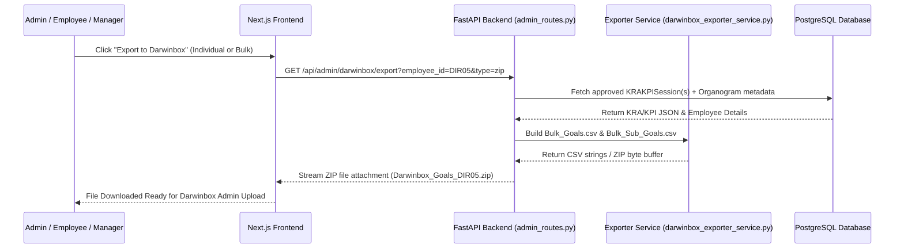

# Darwinbox KRA/KPI Bulk Export — Implementation Architecture & Specification

## Executive Overview
This document specifies the complete, end-to-end implementation plan for the **Darwinbox KRA/KPI Export System** in the JD-Agent platform. 

The system enables **Dual-Tier Export**:
1. **Individual Employee Export**: Export Darwinbox-compatible `Bulk_Goals.csv` and `Bulk_Sub_Goals.csv` directly for a single employee (e.g. from `/jd/[id]` or Admin table row) as soon as their KRAs/KPIs are approved, without waiting for the rest of the organization.
2. **Company-Wide / Department Bulk Export**: Export consolidated `Bulk_Goals.csv` and `Bulk_Sub_Goals.csv` (or a `.zip` bundle) for all approved employees across selected departments or financial cycles.

---

## 1. Target Darwinbox CSV Specifications & Default Column Mappings

### A. Template 1: `Bulk Goals.csv` (Parent Goals / KRAs)

| # | Darwinbox Column Name | Target Value / Data Source in JD-Agent | Default / Fallback Value |
|---|---|---|---|
| 1 | `Goals / Key Result Areas Code*` | `EMP_ID` + `_KRA_` + `Index` (e.g. `DIR05_KRA_01`) | Generated Unique Code |
| 2 | `Methodology` | System Constant | `Goal Base` |
| 3 | `Enable Sub Goal` | System Constant | `Yes` |
| 4 | `Allow to add or remove Sub Goal` | System Constant | `Yes` |
| 5 | `Goals / Key Result Areas Name` | `kra.title` | Extracted KRA Title |
| 6 | `Tagged To` | System Constant | `Individual` |
| 7 | `Assigned To` | `employee_id` (e.g. `DIR05`, `E8929`) | Employee Code |
| 8 | `Mandatory` | System Constant | `No` |
| 9 | `Achievement %` | System Constant | `0` |
| 10 | `Goals / Key Result Areas Description` | `kra.description` | Detailed KRA Description |
| 11 | `Is Goals / Key Result Areas Description Editable?` | System Constant | `Yes` |
| 12 | `Timelines Start Date` | Configurable Cycle Start | `01-04-2025` |
| 13 | `Timelines End Date` | Configurable Cycle End | `31-03-2026` |
| 14 | `Is Timelines editable?` | System Constant | `Yes` |
| 15 | `Goals / Key Result Areas Status` | Status Mapping (`approved` → `Approved`) | `Approved` |
| 16 | `Weightage` | `kra.weight` (e.g. `35.00`) | Numeric Weightage % |
| 17 | `Is Weightage editable?` | System Constant | `Yes` |
| 18 | `Target` | `kra.target` or `100` | `100` |
| 19 | `Target type` | System Constant | `Percentage` |
| 20 | `Is Target editable?` | System Constant | `Yes` |
| 21 | `Metric` | System Constant | `%` |
| 22 | `Is Metric editable?` | System Constant | `Yes` |
| 23 | `Achieved` | Empty | `` |
| 24 | `Scorecard Pillar` | Empty | `` |
| 25 | `Is Scorecard Pillar editable?` | System Constant | `Yes` |
| 26 | `Tags Option` | Empty | `` |
| 27 | `Is Tags Option editable?` | System Constant | `Yes` |
| 28 | `Achievement Mapping` | Empty | `` |
| 29 | `Is Achievement Mapping editable?` | System Constant | `Yes` |
| 30 | `Goals / Key Result Areas Score Formula` | System Constant | `` |
| 31 | `Is Goals / Key Result Areas Score Formula editable?` | System Constant | `Yes` |
| 32–49 | `Custom Field 1 ID` .. `Is Custom Field 6 editable?` | Empty / System Constant | Defaults |
| 50 | `Actions` | System Constant | `Add` |

---

### B. Template 2: `Bulk Sub Goals.csv` (Sub-Goals / KPIs)

| # | Darwinbox Column Name | Target Value / Data Source in JD-Agent | Default / Fallback Value |
|---|---|---|---|
| 1 | `Sub Goal ID` | `EMP_ID` + `_KPI_` + `Index` (e.g. `DIR05_KPI_01_01`) | Generated Unique Code |
| 2 | `Goals / Key Result Areas Code*` | Matches `Goals / Key Result Areas Code*` in Goals CSV | `DIR05_KRA_01` (Links KPI to Goal) |
| 3 | `Sub Goal Name` | `kpi.kpi_title` | Extracted KPI Title |
| 4 | `Achievement %` | System Constant | `0` |
| 5 | `Description` | `kpi.description` + Thresholds summary | Detailed KPI Description |
| 6 | `Is Description Editable?` | System Constant | `Yes` |
| 7 | `Timeline Start Date` | Configurable Cycle Start | `01-04-2025` |
| 8 | `Timeline End Date` | Configurable Cycle End | `31-03-2026` |
| 9 | `Is Timeline editable?` | System Constant | `Yes` |
| 10 | `Sub Goal Status` | Status Mapping (`approved` → `Approved`) | `Approved` |
| 11 | `Weightage` | `kpi.weight` (e.g. `50.00`) | Sub-Goal Weightage % |
| 12 | `Is Weightage editable?` | System Constant | `Yes` |
| 13 | `Target` | `kpi.target_value` | e.g. `98` or `100` |
| 14 | `Is Target editable?` | System Constant | `Yes` |
| 15 | `Target Type` | System Constant / `kpi.unit` | `%` / `Numeric` |
| 16 | `Metric` | `kpi.unit` (e.g. `%`, `Hours`, `Count`) | `%` |
| 17 | `Is Metric editable?` | System Constant | `Yes` |
| 18 | `Achieved` | Empty | `` |
| 19 | `Sub Goal Score Formula` | `kpi.measurement_formula` | Formula text |
| 20 | `Is Goal Score Formula editable?` | System Constant | `Yes` |
| 21–38 | `Custom Field 1 ID` .. `Is Custom Field 6 editable?` | Empty / System Constant | Defaults |
| 39 | `Actions` | System Constant | `Add` |
| 40 | `Enable Activities?` | System Constant | `No` |
| 41 | `Make Activities Alias Editable?` | System Constant | `Yes` |
| 42–61 | `Activity 1 Title` .. `Activity 5 Due Date` | Empty | `` |

---

## 2. System Architecture & End-to-End Flow

---

## 3. Component Design & File Modifications

### 1. Backend Service: `backend/app/services/darwinbox_exporter_service.py`
* Defines `BULK_GOALS_HEADERS` (50 columns) and `BULK_SUB_GOALS_HEADERS` (61 columns) matching exact CSV files.
* Function `export_darwinbox_goals_csv(records: list[dict], cycle_start="01-04-2025", cycle_end="31-03-2026") -> str`
* Function `export_darwinbox_subgoals_csv(records: list[dict], cycle_start="01-04-2025", cycle_end="31-03-2026") -> str`
* Function `export_darwinbox_zip_bundle(records: list[dict], filename_prefix="Darwinbox_Export") -> bytes`

### 2. FastAPI Routes: `backend/app/routers/admin_routes.py` & `backend/app/routers/kra_kpi_routes.py`
* `GET /api/admin/darwinbox/export`
  * Query parameters:
    * `employee_id` (Optional string: if provided, exports single employee; if omitted, exports bulk).
    * `department` (Optional string: filter by department).
    * `type` (`zip`, `goals`, `subgoals`).
  * Returns `StreamingResponse` with proper headers (`Content-Disposition: attachment; filename=...`).

### 3. Frontend UI Integration:
* **A. Individual Page (`frontend/app/(dashboard)/jd/[id]/page.tsx` & `kra-kpi-panel.tsx`)**:
  * Add a **"Export for Darwinbox"** dropdown button on the top-right of the KRA/KPI tab when status is `approved` or `sent_to_hr` or `confirmed`.
  * Allows downloading `Bulk_Goals.csv`, `Bulk_Sub_Goals.csv`, or `.zip` package for that single employee immediately.
* **B. Admin Dashboard (`frontend/app/(dashboard)/dashboard/[id]/page.tsx` & Admin Reports)**:
  * Add a **"Darwinbox Export Hub"** button in Admin header & row action menus.
  * Modal opens with filters (Financial Year, Department, Status) and instant download buttons.
